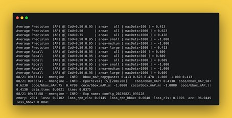
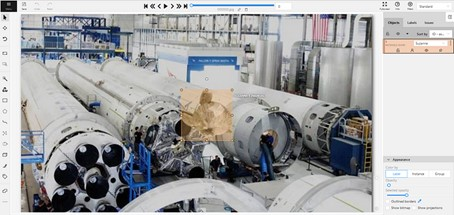
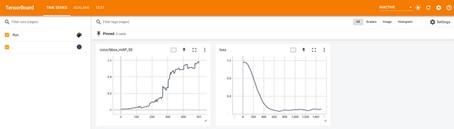

# mmdet
Train a Faster-RCNN object detection model on CVAT data with containerized MMDetection. Training can be visualized with Tensorboard.
For more details, see [Learn How to Train Object Detection Models With MMDetection](https://medium.com/towards-artificial-intelligence/learn-how-to-train-object-detection-models-with-mmdetection-7a2441804875)



# Installation & Setup
## CVAT
You can create an account for the free online version [app.cvat.ai](https://app.cvat.ai/) or [run your own server](https://opencv.github.io/cvat/docs/administration/basics/installation/).

After labeling your data, export a train and a test dataset in the COCO 1.0 format. 
This will give you images and annotations folders, which should be placed in the data folder in train and test.




## Docker Image
Build an image with `sudo docker build -t mmdet:latest .`

## Tensorboard
`pip install tensorboard`

# Training
## Run MMDetection training
Run the image with the following command (modify path to mmdet folder):
```
docker run --gpus all \
  -v "/path/to/mmdet/my_configs:/mmdetection/my_configs:ro" \
  -v "/path/to/mmdet/data:/mmdetection/data:ro" \
  -v "/path/to/mmdet/workdir:/mmdetection/workdir" \
  mmdet:latest
```

## Tensorboard
To visualize the training process, cd to the latest folder in workdir and run `tensorboard --logdir vis_data/`.
In your browser, open [http://localhost:6006/](http://localhost:6006/).




# Used Frameworks
- [MMDetection](https://github.com/open-mmlab/mmdetection) for model training
- [CVAT](https://github.com/opencv/cvat) for annotating and exporting training/testing data
- [TensorBoard](https://www.tensorflow.org/tensorboard) for training visualization
- [blender-gen](https://github.com/ignc-research/blender-gen) to create synthetic object detection data
